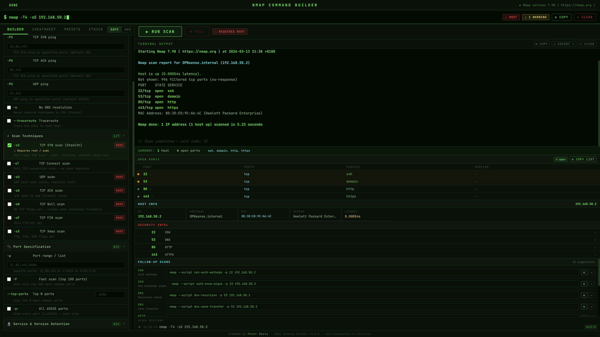

# Nmap Command Builder

A desktop cybersecurity tool for building, executing, and analysing **Nmap scans** through a graphical interface — no command-line experience required.

Built with **Electron + React** and designed for system administrators, cybersecurity students, and network engineers.

---

# Table of Contents

- [Screenshot](#screenshot)
- [Features](#features)
- [Why This Project Exists](#why-this-project-exists)
- [Requirements](#requirements)
- [Installation](#installation)
- [Usage](#usage)
- [Production Build](#production-build)
- [Security Model](#security-model)
- [Responsible Use](#responsible-use)
- [Roadmap](#roadmap)
- [Author](#author)
- [License](#license)

---

# Screenshot

---

# Features

## Command Builder

- Visual flag selector organised into collapsible categories
- Live command preview
- Safe / Advanced mode toggle
- 12 built-in scan presets
- Searchable Nmap cheatsheet

## Scan Execution

- Runs Nmap via `child_process.spawn`
- Live streaming terminal output
- Kill button for long scans
- Export results as `.txt`, `.json`, `.csv`
- Scan history with quick reload

## Post-Scan Intelligence

- Open Ports Panel with risk classification
- Host Info Panel (IP, hostname, MAC, vendor)
- Host Discovery Panel
- Network Map visualisation
- Security Intel Panel
- Follow-up scan suggestions

## Safety & Awareness

- ⚠ ROOT badge for privileged scans
- ⚠ IDS/IPS warning for stealth techniques
- Built-in ethics and legal notice panel

---

# Why This Project Exists

Many powerful cybersecurity tools require deep command-line knowledge.

This project aims to make **Nmap accessible through a graphical interface while still exposing the real commands being executed**.

It helps:

- system administrators
- cybersecurity students
- penetration testers
- network engineers

---

# Requirements

| Requirement | Version |
|---|---|
| Node.js | 18+ |
| Nmap | recent version |
| OS | macOS · Linux |
| Runtime | Electron |

---

# Installation

Clone repository

`git clone https://github.com/peterfromslovakia/nmap-command-builder.git`

`cd nmap-command-builder`

Install dependencies

`npm install`

Install Nmap if needed

macOS (Homebrew)

`brew install nmap`

Debian / Ubuntu

`sudo apt install nmap`

---

# Usage

Run development mode

`npm run dev`

This launches:

- React frontend
- Electron desktop window
- Nmap command builder interface

---

# Production Build

Create optimized build

`npm run build`

Launch Electron production app

`npm run electron`

---

# Security Model

Security design decisions used in the application:

- `contextIsolation` enabled
- `nodeIntegration` disabled
- Nmap execution only from Electron **main process**
- user input validated before execution
- `spawn` used instead of `exec`
- no shell interpolation allowed

---

# Responsible Use

Only scan networks and systems **you own or have explicit authorisation to test**.

Unauthorised port scanning may be illegal in many jurisdictions.

**Slovakia**

Skenovanie sietí bez povolenia je v SR trestným činom podľa § 247 Trestného zákona.

---

# Roadmap

Future improvements planned:

- Windows desktop release (.exe)
- macOS DMG installer
- Linux AppImage build
- integrated Nmap script library
- vulnerability hints based on detected services
- export reports to Markdown / PDF
- improved network topology visualisation

---

# Author

**Peter Obala**

Cybersecurity enthusiast · Network administrator

GitHub  
https://github.com/peterfromslovakia

---

# License

MIT License
